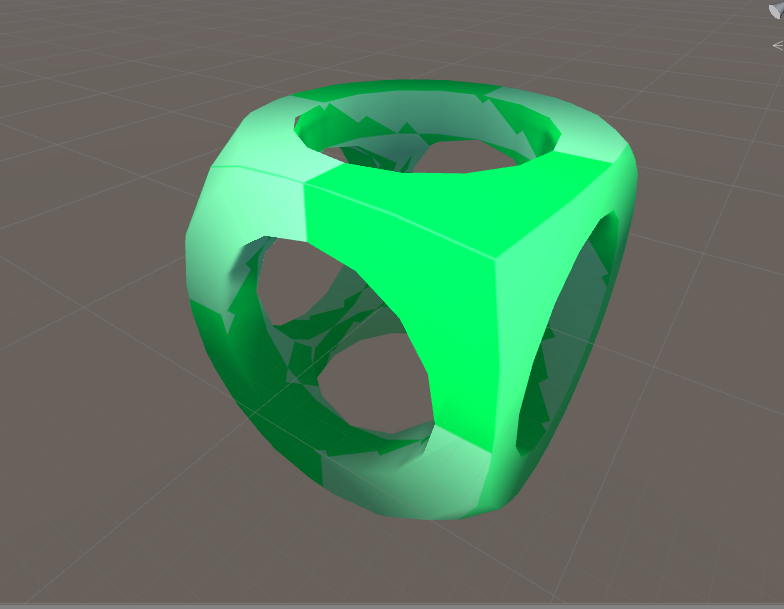

# pb_CSG

A fork of Karl's port of [CSG.js](http://evanw.github.io/csg.js/) for the Unity Game engine with a more efficient and correct interface.

## Description of Changes

This fork of pb_CSG adds a CSG Binary Tree to remove problems of converting to and from GameObjects for complex shapes (In the original code, objects with more than one Subtraction operation would lose their volume and become flat). Moreover this provides a more efficient workflow to creating complex shapes.

Moreover, this fork adds the ability to procedurally generate a variety of shapes. Currently this includes: Box, Sphere, Cylinder, Cone, and Circle/Square/Octagon. 

##Example use:

To build this shape:

	
	//create leaf nodes
	CSG_Tree sphere_leaf = new CSG_Tree(
			MeshGenerator.generate_sphere(origin.x, origin.y, origin.z, 
				1.0f, 5).ToMesh());
	CSG_Tree cube_leaf = new CSG_Tree(
			MeshGenerator.generate_cube(origin.x, origin.y, origin.z, 
			1.4f, 1.4f, 1.4f).ToMesh());
	CSG_Tree cyl1_leaf = new CSG_Tree(
	MeshGenerator.generate_axis_alligned_cylinder(origin.x, origin.y, origin.z, 
			0.5f, 2.0f, MeshGenerator.Axis.X_AXIS,  2).ToMesh());
	CSG_Tree cyl2_leaf = new CSG_Tree(
	MeshGenerator.generate_axis_alligned_cylinder(origin.x, origin.y, origin.z, 
			0.5f, 2.0f, MeshGenerator.Axis.Y_AXIS,  2).ToMesh());
	CSG_Tree cyl3_leaf = new CSG_Tree(
	MeshGenerator.generate_axis_alligned_cylinder(origin.x, origin.y, origin.z, 
			0.5f, 2.0f, MeshGenerator.Axis.Z_AXIS,  2).ToMesh());

	//construct tree
	CSG_Tree cube_intersect_sphere = new CSG_Tree(cube_leaf, sphere_leaf, CSG_Operation.Intersect);
	CSG_Tree cyl1_union_cyl2 = new CSG_Tree(cyl1_leaf, cyl2_leaf, CSG_Operation.Union);
	CSG_Tree cyl3_union_cyl1_2 = new CSG_Tree(cyl3_leaf, cyl1_union_cyl2, CSG_Operation.Union);
	CSG_Tree CIS_subtract_cyls = new CSG_Tree(cube_intersect_sphere, cyl3_union_cyl1_2, CSG_Operation.Subtract);
	//render tree
	CIS_subtract_cyls.render();

	//create new game object from result
	composite= new GameObject();
	composite.transform.position = origin;
	composite.AddComponent<MeshFilter>().sharedMesh = CIS_subtract_cyls.getMesh();
  	composite.AddComponent<MeshRenderer>().sharedMaterial = wireframeMaterial_green;
	

Result:

